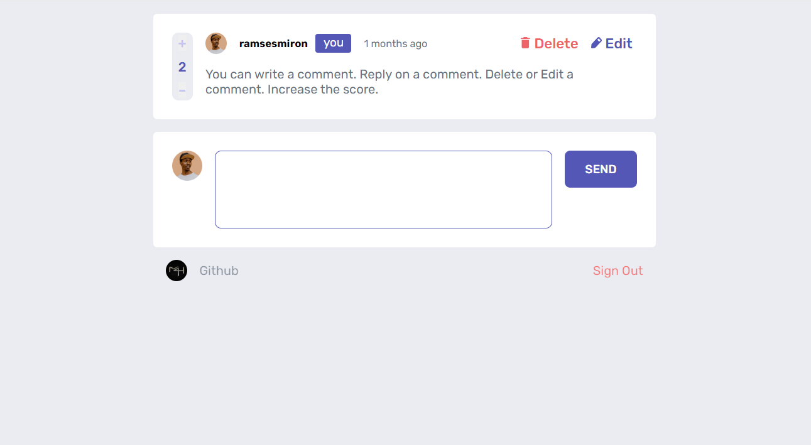

# Interactive comments section

The app is about an interactive comment section with front-end and back-end development. User can choose the character that will comment then inside the comments he can add new comment or reply on others Every thing linked with the DataBase using "mongoose" Server was built using 'Express' and 'node.js' Templeting using 'EJS'  [Preview](https://interactivecomment.onrender.com/)

## Table of contents

  

-  [Overview](#overview)

-  [Screenshot](#screenshot)

-  [Links](#links)

-  [Built with](#built-with)

## Overview

### The challenge

Users are able to:

  

- View the optimal layout for the app depending on their device's screen size

- See hover states for all interactive elements on the page

- Create, Read, Update, and Delete comments and replies

- only edit or delete their own comments and replies.

- Upvote and downvote comments
- All Comments are saved on the MongoDB Atlas
- Replying to a comment adds the new reply to the bottom of the nested replies within that comment.
- A confirmation modal pops up before a comment or reply is deleted.

### Screenshot

### Links

- Live Site URL: [Preview](https://radiant-gorge-15308.herokuapp.com/)
- LinkedIn - [Mohamed Hosam](https://www.linkedin.com/in/m4hosam/)

## My process

### Built with

- Semantic HTML5 markup
- CSS custom properties
- Flexbox
- CSS Grid
- Mobile-first workflow
- EJS Templete Engine
- MongoDB as a Database
- Node.js Back-end JavaScript runtime environment 
- Express js Back-end web application framework for Node.js

- Mongoose connection between MongoDB and the Express web application framework.

